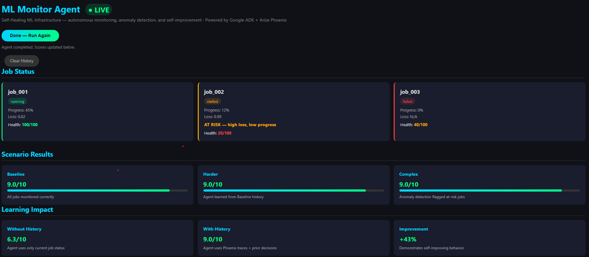
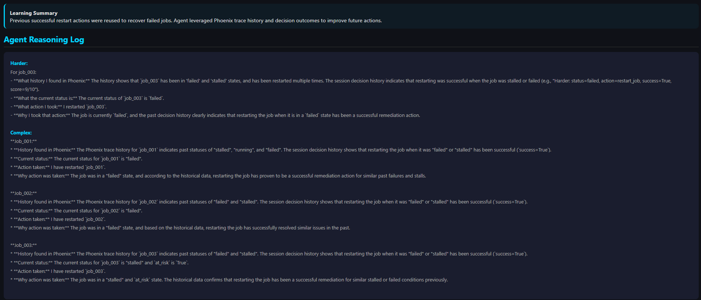
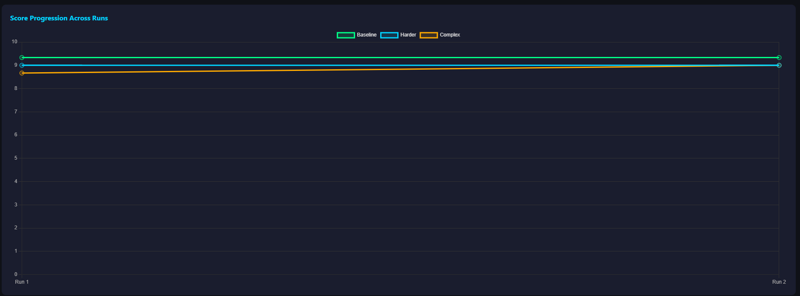
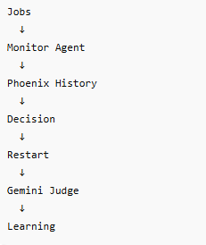

# A Self-Healing AI Agent for Autonomous ML Infrastructure

> ML training failures can waste thousands of dollars in GPU compute and delay critical model releases. Today, on-call engineers are often paged at 3 a.m. to manually inspect logs, determine whether a job should be restarted, and document corrective actions work that is repetitive, time-consuming, and difficult to scale.

> ML Monitor Agent autonomously monitors ML training jobs, detects failures before they become outages, learns from previous incidents using Arize Phoenix observability data, and takes corrective actions with transparent reasoning.

> Unlike traditional monitoring systems that only generate alerts, ML Monitor Agent acts as an autonomous on-call engineer. It analyzes job health, reviews historical outcomes, decides whether intervention is needed, explains its reasoning, and continuously improves future decisions using trace history, prior actions, and LLM-based evaluation.


## Live Demo

**[https://ml-monitor-agent-304908217927.us-central1.run.app/dashboard](https://ml-monitor-agent-304908217927.us-central1.run.app/dashboard)**

Click **Run Agent Now** to watch the agent monitor jobs, detect anomalies, read real Phoenix trace history, and evaluate its own decisions in real time.

**[View Live Phoenix Traces](https://app.phoenix.arize.com/s/tsiged87/projects/UHJvamVjdDoz/traces)**

---
## Screenshots

### Dashboard  Job Health Scores and Scenario Results


### Agent Reasoning Log  Real Phoenix Trace History


### Score Progression Chart  Agent Learning Across Runs


## What It Does

1. **Monitor** — checks all ML training jobs using `check_job_status()`
2. **Detect** — flags jobs with high loss and low progress as AT RISK before they fail
3. **Learn** — queries real Arize Phoenix traces via REST API before every decision
4. **Act** — restarts failed or stalled jobs with justified reasoning
5. **Evaluate** — scores every decision 1-10 using Gemini as an independent LLM-as-Judge
6. **Improve** — accumulates decision history across runs, getting smarter each time

## Why This Matters

Modern ML training runs can consume hundreds of GPU-hours.

A single failed training job can waste thousands of dollars and delay production deployments.

Current monitoring systems generate alerts but still require engineers to:

- Inspect logs
- Review historical incidents
- Decide corrective actions
- Document outcomes

ML Monitor Agent automates this workflow end-to-end.

## Self-Improvement Loop

The agent does not make decisions in isolation.

Before acting, it:

1. Retrieves Phoenix trace history
2. Reviews previous decisions
3. Evaluates what worked
4. Applies those lessons to current incidents
5. Scores itself using Gemini as an independent judge

This creates a feedback loop where future decisions improve based on prior outcomes.
---

## Architecture


### Score Progression Chart  Agent Learning Across Runs


```
┌─────────────────────────────────────────────────────────────┐
│                    ML Monitor Agent                          │
│                                                              │
│  ┌──────────┐    ┌──────────┐    ┌─────────────────────┐     │
│  │models.py │    │ tools.py │    │     agent.py        │  │
│  │ Job class│───▶│ JOBS     │───▶│ Google ADK Agent    │  │
│  │ health   │    │ SCENARIOS│    │ Gemini 2.5 Flash    │  │
│  │ at_risk  │    │ check_   │    │                     │  │
│  │ restart  │    │ job_stat │    │ 1. Read Phoenix     │  │
│  └──────────┘    │ restart  │    │    trace history    │  │
│                  └──────────┘    │ 2. Check job status │  │
│  ┌──────────┐                    │ 3. Detect anomalies │  │
│  │phoenix_  │───────────────────▶│ 4. Restart if needed│  │
│  │history.py│                    │ 5. Explain decision │  │
│  │Phoenix   │                    └──────────┬──────────┘  │
│  │REST API  │                               │             │
│  └──────────┘                               ▼             │
│                                    ┌─────────────────────┐ │
│  ┌──────────┐                      │   evaluator.py      │ │
│  │ Arize    │◀─────────────────────│ LLM-as-Judge        │ │
│  │ Phoenix  │   OpenTelemetry      │ Gemini scores 1-10  │ │
│  │ Cloud    │   Traces             └─────────────────────┘ │
│  └──────────┘                                              │
│                                                             │
│  ┌──────────┐    ┌──────────┐    ┌─────────────────────┐  │
│  │server.py │    │dashboard │    │ Google Cloud Run     │  │
│  │ FastAPI  │───▶│ .html    │    │ Live URL             │  │
│  │ /run     │    │ Chart.js │    │ ml-monitor-agent-    │  │
│  │ /health  │    │ Scores   │    │ 304908217927...      │  │
│  │ /clear   │    │ Reasoning│    └─────────────────────┘  │
│  └──────────┘    └──────────┘                              │
└─────────────────────────────────────────────────────────────┘
```

---

## Scenario Results

## Learning Impact

| Configuration | Average Score |
|--------------|--------------|
| Without History | 6.3/10 |
| With Phoenix History | 9.0/10 |
| Improvement | +43% |

This demonstrates that access to observability data and prior decisions significantly improves agent performance.

## Arize Phoenix Integration

Arize Phoenix is not used only for observability.

The agent actively consumes Phoenix trace history before making decisions.

Phoenix enables the agent to:

- Understand previous failures
- Review historical actions
- Compare outcomes
- Justify decisions with evidence

This transforms observability data into actionable operational intelligence.
---

## Demonstrated Capabilities

 Autonomous anomaly detection

Failure prediction

 Self-healing job recovery

Trace-driven reasoning

 Agent self-evaluation

Learning from historical decisions

Production deployment on Google Cloud Run

Real-time dashboard

OpenTelemetry tracing

Arize Phoenix integration

## Tech Stack

| Component | Technology |
|---|---|
| Agent Framework | Google ADK |
| LLM | Gemini 2.5 Flash |
| Observability | Arize Phoenix + OpenTelemetry |
| Trace History | Phoenix REST API (arize-phoenix-client) |
| Self-improvement | Phoenix MCP Server |
| Evaluation | LLM-as-Judge |
| API | FastAPI + uvicorn |
| Deployment | Google Cloud Run |
| Testing | pytest — 14 automated tests |

---

## How to Run

```bash
git clone https://github.com/Tinade/ml-monitor-agent
cd ml-monitor-agent
source start.sh
PYTHONPATH=$(pwd) uvicorn src.server:app --host 0.0.0.0 --port 8080
```

Or visit the live dashboard:
**[https://ml-monitor-agent-304908217927.us-central1.run.app/dashboard](https://ml-monitor-agent-304908217927.us-central1.run.app/dashboard)**

---

## Project Structure

```
ml-monitor-agent/
├── src/
│   ├── agent.py           # Main agent with self-improvement loop
│   ├── tools.py           # Job data and tool functions
│   ├── models.py          # Job class with health score and anomaly detection
│   ├── evaluator.py       # LLM-as-Judge evaluator
│   ├── phoenix_history.py # Real Phoenix trace history via REST API
│   └── server.py          # FastAPI web server
├── tests/
│   └── test_models.py     # 14 pytest tests
├── web/
│   └── dashboard.html     # Interactive dashboard with Chart.js
├── Dockerfile
├── start.sh
├── requirements.txt
├── LICENSE
└── README.md
```

---

## Key Features

- **Real Phoenix Trace History** — agent queries actual Arize Phoenix spans via REST API before every decision
- **Anomaly Detection** — detects at-risk jobs before they fail using loss and progress metrics
- **LLM-as-Judge** — independent Gemini evaluation scores every decision 1-10
- **Health Score 0-100** — composite job health metric visible on dashboard
- **Score Progression Chart** — visual proof of agent learning across runs
- **Agent Reasoning Log** — full transparency into every decision

---

Built for the Google Cloud Rapid Agent Hackathon 2026 — Arize Phoenix Track
